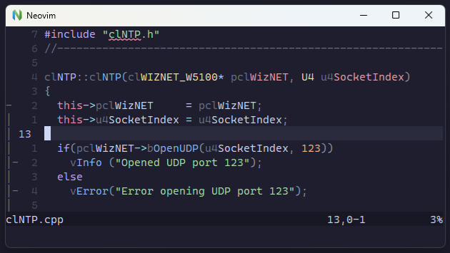

# Tree-sitter Hungarian

Hungarian notation grammar for language-injection

## Use Case

This parser is meant to be used as an injected language for Neovim Tree-sitter
setups, typically for C or C++. The purpose is to hide the Hungarian prefixes
where the company coding standard demands it.



## Setup Process

Configure your `treesitter.lua` (or equivalent) as follows:

```lua
local parser_config = require('nvim-treesitter.parsers').get_parser_configs()

parser_config.hungarian = {
  install_info = {
    url = "https://github.com/jpt13653903/tree-sitter-hungarian.git",
    files = { 'src/parser.c' },
    branch = 'master',
    generate_requires_npm = false,
    requires_generate_from_grammar = false,
  },
  filetype = 'hungarian',
}

local treesitter = require('nvim-treesitter.configs')

treesitter.setup {
  ensure_installed = {
    -- Some list of languages...
    'hungarian',
    -- Some more languages...
  },

  -- Some other options and configuration...
}
```

Then copy the `queries` folder to your `after` configuration folder,
typically `~/.config/nvim/after/` on Linux
and `~/AppData/Local/nvim/after/` on Windows.

Finally, run `:TSUpdate`.

## Building

- Follow the instructions
  [here](https://tree-sitter.github.io/tree-sitter/creating-parsers#getting-started)
  to setup your development environment.
- Run `npm install --save-dev tree-sitter-cli`
- Run `node_modules/tree-sitter-cli/tree-sitter.exe generate`

